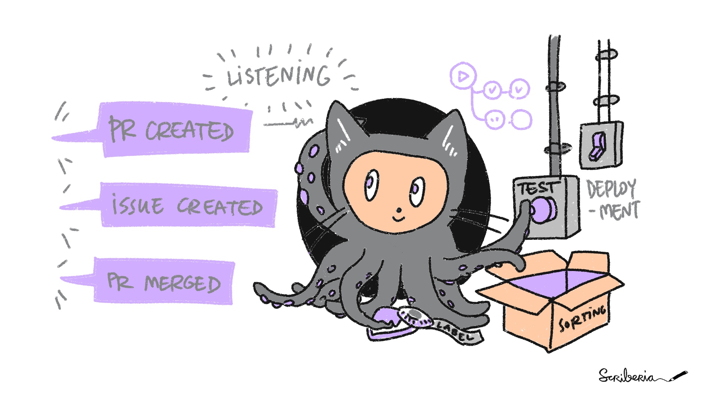

# Projectopia documentation

!!! important "Powered by GitHub"

    Empower Your Projects with Effortless Beginnings. Projectopia ignites your projects with a seamless start, removing barriers so you can dive into creativity effortlessly.

## Welcome to Projectopia Technical Documentation

Projectopia streamlines your project initiation, equipping you with:

- Template Application: Swiftly apply pre-defined project structures and configurations.
- Automated **GitHub** Repository Creation: Eliminate manual setup with instant GitHub repository generation.
- Pre-configured **GitHub Actions** Workflow: Streamline development processes with pre-defined automation workflows.

### Quick start

- Go to **Technical Explaination** to learn deep-dive on tech stack that we use
- Go to **Workflow Explaination** for an overview of how we doing this project
- Go to **Scaffold - Soul of Projectopia** for an overview of the heart of Projectopia
