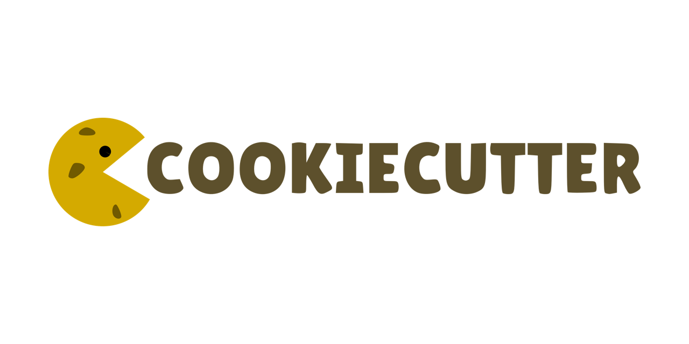

# Scaffold - Soul of Projectopia

!!! info "Example of scaffold in real life"
    Imagine building a LEGO house! Scaffolding in design is like having a basic LEGO frame ready. You can choose the frame and then add your own colors, rooms, and decorations to make it your own special dream house! So the ability of customizations are the power of scaffolds.

## What is Software Scaffold

Ever heard of traditional software templates? They're like pre-made blueprints for websites, APIs, or even Docker containers. But let's be honest, traditional templates often leave you feeling lost:

- Lack of resources, customizations
- Not clear about the tech they use in that template, making modifications a challenge.
- Not have clear documentations on how to adapt and how to work with that template
- No clue how to launch/deploy your creation and make it accessible to the world.

!!! example "DevOps is rock 😮‍💨"

So that why...

## Why Choose Scaffold but not traditional Template

| Feature          | Scaffold                                     | Traditional Template                  |
| ---------------- | -------------------------------------------- | ------------------------------------- |
| Customization    | ✅ Adjust parameters during application      | ❌ Fixed structure,    configuration  |
| Community-Driven | Contribute and benefit from shared Scaffolds | Limited to pre-defined options        |
| Flexibility      | Tailor to specific project requirements      | One-size-fits-all approach            |
| Contribution     | Open to community contributions              | Closed approach                       |

## How we making Software Scaffolds

**Projectopia** ignites your projects with effortless beginnings, and at the heart of this lies **Software Scaffold**, a powerful tool that goes beyond traditional templates. **Scaffold** empowers you with:

- Customization: Unlike rigid templates, Scaffolds allow you to fine-tune parameters and choose specific configurations during application, ensuring a perfect fit for your project's unique needs.
- Community-Driven: **Projectopia** fosters a vibrant Scaffold Community where developers can contribute verified, high-quality Scaffolds. This ever-growing library provides a wealth of options for diverse project types and preferences.
- Powered by **Cookiecutter**: **Projectopia** leverages the robust **Cookiecutter** engine, ensuring a reliable and efficient experience while generating your project structure.

