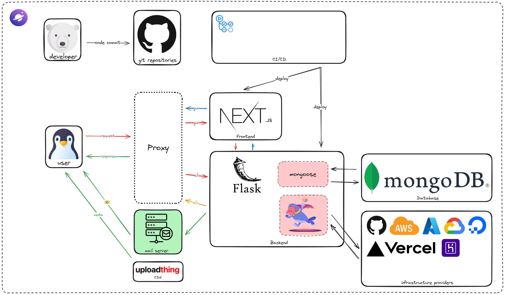

# Workflow Explaination

## tl;dr: Projectopia Workflow

1. Create Project: Fill out a form on our NextJS frontend to create a GitHub project with your desired setup.
2. Automated Setup: Our server clones your repo, applies your chosen scaffold with CI/CD, and pushes it to GitHub.
3. Deployment (Optional): Choose to deploy your app to Vercel (backend) or GitHub Pages (static) for free, or pay for premium infrastructure (AWS, GCP, Azure).

!!! note "Important Note"
    Your inputs are stored securely for future support and infrastructure deletion.

## Detailed Workflow

- User will create project on our frontend form (written in **NextJS**), and it will make a request to our **Flask** API to create a GitHub Project based on user's inputs.
- Then our server will clone your generated Repo on Github using **Projectopia Bot Account** and **apply scaffold**, then push to it.
!!! example "Information"
    Our MongoDB Database will store your inputs as hashed key and use them for supporting and deleting infrastructure purpose if you want in the future.
- After that, Projectopia Bot will apply **CI/CD workflows** on your generated repo and trigger deploy your application on your/our infrastructure (default will be Vercel for backend app and Github Pages for static app).

!!! warning "Deployment Cost"
    Deployment is optional. But if you choose to deploy on our premium infrastructure (AWS, GCP, Azure,...), we will charge you with a customized pricing.
